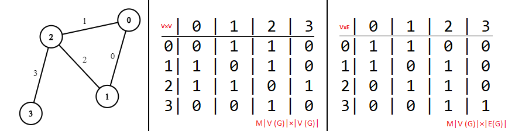
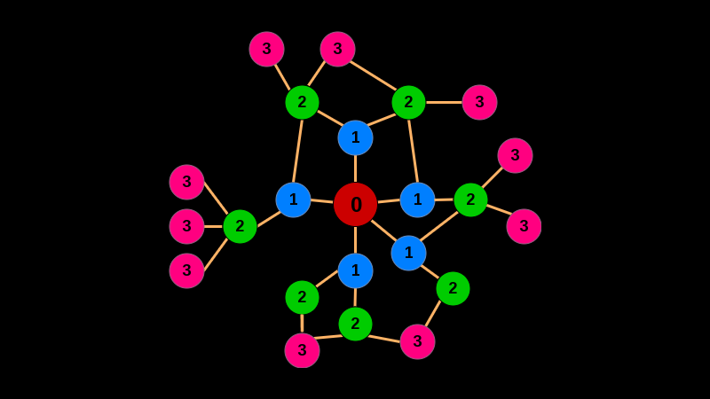
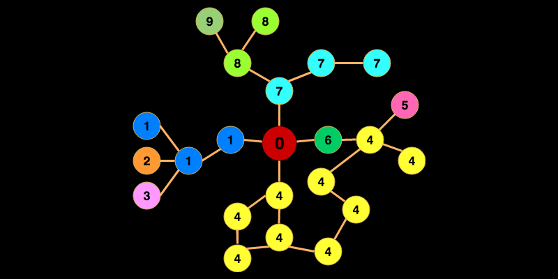

# Algoritmos em Grafos

## Como representar computacionalmente um grafo?

Tem várias formas de representarmos um grafo dentro da Computação. Uma delas é a Matriz de Incidência. Onde as colunas são as arestas e as linhas os vértices. E assim vai computando como 1, os pares em que a aresta incide no vértice.

Créditos imagem: [https://medium.com/xp-inc/grafos-teoria-e-aplica%C3%A7%C3%B5es-2a87444df855](https://medium.com/xp-inc/grafos-teoria-e-aplica%C3%A7%C3%B5es-2a87444df855)

No entanto esta não é uma forma eficiente de representação.

Muitas aplicações e soluções para alguns problemas exigem que exploremos um determinado grafo e para isso existem algoritmos eficientes que fazem esse tipo de exploração. São eles: Busca em Largura e Busca em Profundidade

## Busca em Largura

Quando falamos em Busca, queremos dizer que temos de visitar todos os vértcies de um grafo. A Busca em Largura é uma técnica de visitação dos vértices. A técnica consiste em:

Escolha, primeiramente, um vértice qualquer, visita este vértice. Logo em seguida, olhe para seus vértices adjacentes e os visita. Em seguida, olhe para os adjacentes dos adjacentes e os visita. E assim por diante.

A estrutura de dados que melhor representa uma busca em largura é a FILA com o método FIFO \(First In First Out\). A ideia do algoritmo é:

Coloce na fila um vértice qualquer $$u$$ de $$G$$ e marque como visitado; Enquanto a fila for diferente de VAZIO faça: atribui o elemento da frente da fila para $$u$$ e retire o $$u$$ da fila \(a fila fica **momentaneamente** vazia\). Depois, para toda aresta adjacente a $$u$$tal que o seu vértice $$w$$ não tenha sido alcançado, marque $$w$$ como **alcançado** e coloque-o na fila. Repita os passos até ter visitado todos os vértices.

## Busca em Profundidade

Já a Busca em Profundidade é justamente ao contário da Busca em Largura. Como a busca em Largura olha de forma **macro**. A Busca em Profundidade olha de forma **micro**. Sendo assim o algoritmo funciona assim:

Escolha um vértice qualquer $$u$$em G e marque como visitado. Agora olhe somente para um vértice adjacente que ainda não foi visitado, e visita ele. Olha olhe para um adjacente deste vértice no qual ainda não foi visita e o visita. E assim por diante. O algoritmo mergulha dentro do Grafo até um ponto onde um determinado vértice não possui nenhum vértice adjacente. 

Quando isso acontece, ele volta para o vértice anterior e olha os seus adjacentes que ainda não foram visitados, caso exista algum, E o processo continua desta forma.

A estrutura desse algoritmo é diametralmente oposta ao da Busca em Largura, que é a Pilha com a técnica FILO \(First In Last Out\). Que segue esta lógica:

Emplique um vértice qualquer $$u$$de $$G$$ e marque como visitado. Enquanto a pilha não for nula faça: $$u$$recebe o elemento do topo da pilha. Se existir uma aresta \($$u$$, $$w$$\) tal que $$w$$ ainda não foi visitado, marque $$w$$como visitado e empilha-o, caso contrário, desempilha $$u$$.

## O problema do Caminho Mínimo

Como eu parto de uma genarilização do algoritmo em largura que resolve a distancia de um certo ponto ao outro para um problema com **custos** em ****suas ****arestas?

Uma solução seria trocar os custos por caminhos de mesmo custo. Exemplo: tranforma um caminho de custo 8 por 8 vértices, 8 caminhos. Faça isso para cada caminho com custo. E assim conseguimos aplicar busca em largura.

## Algoritmo de Dijkstra

O problema do caminho mínimo é resolvido utilizando o algoritmo chamado Algoritmo de Dijkstra \(1959\). Ele funciona como um generalização do algoritmo de busca em largura. 

O algoritmo faz uma projeção do custo para o próximo vértice. Assim ele escolher o vértice que apontou-se ser o de menor custo. Depois de atinjido temos que atualizar os custos dos vértcies **adjacentes** \(ainda não atinjidos\) e  assim por diante. Relizando esse procedimentos descobrimos o custo de menor caminho. 

Agora a questão é: Quel é o caminho que apresentou esse menor custo? Para descobrirmos isso fazemos o "caminho inverso". Como se voltássemos para a origem de acordo com os custos finais. Substraindo o custo em cada caminho com ocusto final dos vértices adjacentes e escolhendo o caminho que o cálculo bate com o custo do vértice até cehgarmos na origem.

## Algoritmo de Bellman-Ford-Moore

## Algoritmo de Floyd – Warshall

