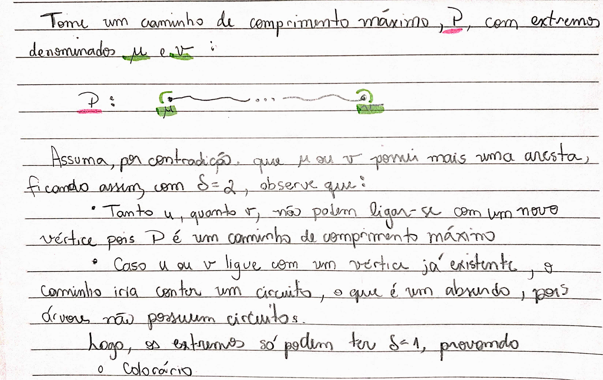
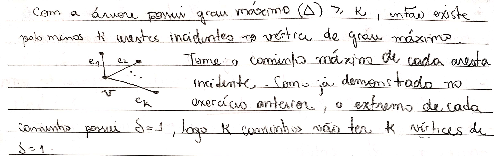
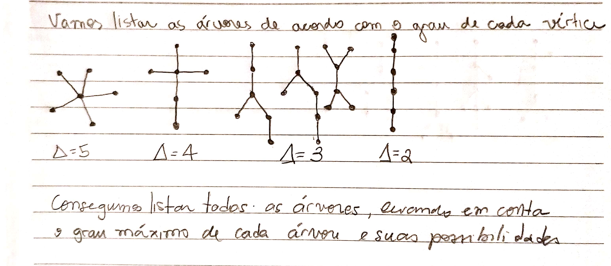

# Exercícios

## 1\).

### Colorario

Toda árvore com pelo menos dois vértices tem pelo menos dois vértices de grau um.

#### Prove o Corolário anterior mostrando que a origem e o término de um caminho mais longo em uma árvore não trivial têm grau um.

## 2\).

#### Mostre que toda árvore com $$∆ ≥ k$$ tem pelo menos $$k$$ vértices de grau um.

## 3\).

#### Desenhe todas as árvores não isomorfas com 6 vértices

