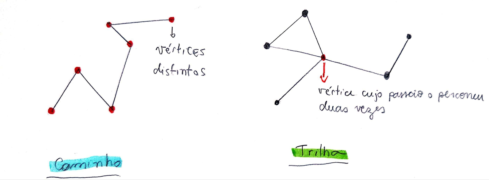
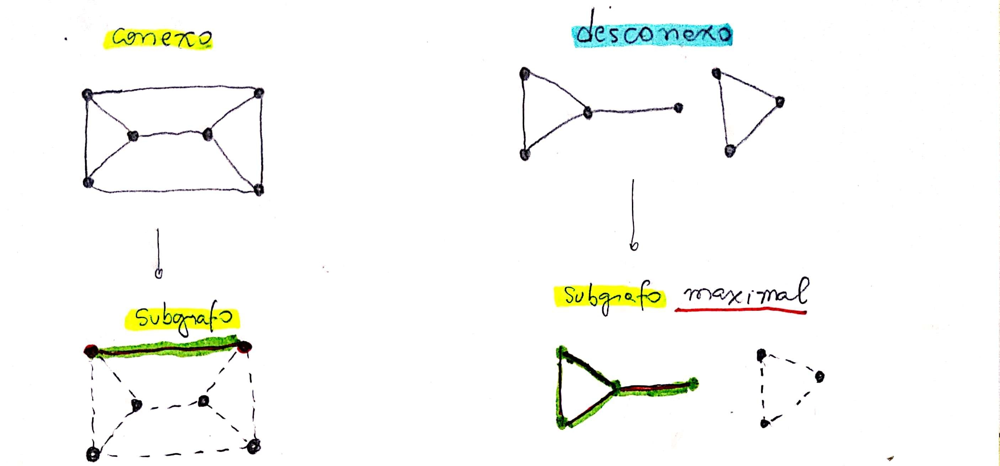

# Caminhos e Circuitos

## Passeio

Um passeio em um grafo $$G$$ é uma sequência finita e _não nula_ $$W$$ = \( $$ v_0 e_1 v_1 e_2 ...e_k v_k$$\) cujos termos são alternadamente **vértices** e **arestas**, tais que, para $$1 ≤ i ≤ k$$ , os extremos de $$e_i$$ são $$v_i−_1 $$ e $$v_i$$ .

Chamamos $$v_0 $$ de **origem** e $$v_k $$ de **término** do passeio $$W$$ e os demais vértices, $$v_1..v_k-_1$$ são chamados de vértices **internos**. E o **comprimento** de $$W$$ é $$k$$ \(número de vértices\).

## Trilha

Trilha é quando as arestas do passeio são distintas.

## Caminho

Caminho são passeios em que os vértices são distintos. Ou seja, o passeio não passa novamente em um mesmo vértice.

## Grafo Conexo e Desconexo

Um grafo é **conexo** se existe caminho ligando qualquer par de vértices. Caso contrário, ele é **desconexo**. Ou seja, grafo conexo é possível desenhar um caminho em que conseguimos percorrer todos os vértices sem _**"tirar o lápis do papel".**_

### Componente

Componentes de um grafo são subgrafos conexos maximais. Ou seja, um caminho em que conseguimos percorrer o maior número de vértices possível dentro da parte conexa do grafo.

## Circuito

### Passeio fechado

## Lema

### Prova

## Lema 2

### Prova

