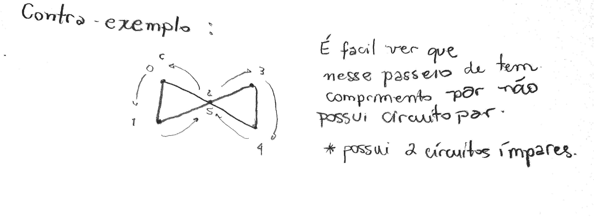

# Exercícios

## 1\).

#### Mostre que se existe um passeio ligando os vértices $$u$$ a $$v$$ em um grafo G então existe um caminho de $$u$$a $$v$$.

## 2\).

#### Prove ou disprove: Todo grafo conexo G possui um caminho que contém todos os vértices de G.

Não. Nem todo grafo conexo é um caminho, Ou seja, existem grafos conexos em que possui passeios com vértices repetidos.

Contra-exemplo:

## 3\).

#### Prove ou disprove: Um passeio fechado de comprimento par contém um circuito de comprimento par

## 4\).

#### Mostre que se $$\delta \geq 2$$ então G contém um circuito

## 5\).

#### Para quais valores de n o Circuito Cn é auto-complementar?

Fazendo por meio de tentativas começando com C3 até o C6, C7.. Conseguimos concluir que o único cirucuito que é auto-complementar é o Circuito C5. De forma genérica: Considere o Circuito Cn, se ele é auto-complementar, seu complemento também tem n arestas. A quantidade total de arestas do Cn com seu complemento dá um grafo completo. E vimos que a quantidade de arestas de um grafo simples completo é n\(n-1\)/2. Logo:

$$
n+n = 2n = \frac{n(n-1)}{2} \\
4 = n-1 \\
n = 5
$$

> Anotações feita com base nos slides de grafos do professor Marcelo Henriques de Carvalho da FACOM-UFMS.

