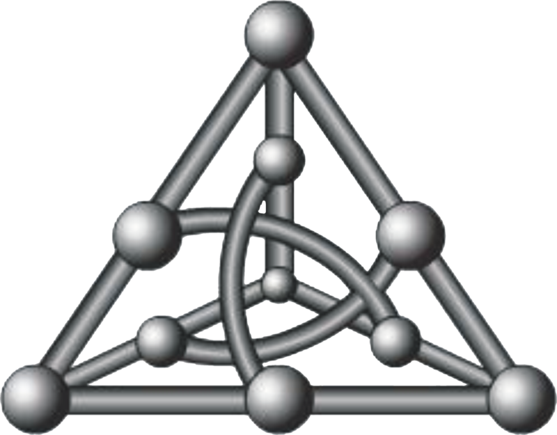
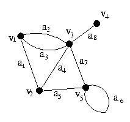

# Conceitos

## Conceitos

### Vértices e Arestas

Um grafo **G** consiste de um conjunto finito de elementos denominado **vértices** \(denotado por _V\(G\)_ \) e um conjunto de pares não ordenado de vértices denominado **arestas** \(denotado por _E\(G\)_ \).

> Vértices são como os pontos e as arestas como a ligação desses pontos.

Existem diferentes formas de visualizar um grafo. 

### Liga e extremos

Seja  _e_   uma aresta construída com vértices _u_ e _v_  dizemos que _e_ **liga** _u_ a _v ._ Denotamos por _e = \(u,v\)_ ou _e = uv_. Os vértices _u_ e _v_ são chamados de _extremos_.

#### Incidência

Dizemos que os extremos são incidentes à arestas e vice-versa pois se um extremos existe certamente uma aresta também existe e o contrário também é verdade. Se uma aresta existe, então os extremos também existem.

### Adjacência

Uma adjacência ocorre quando vértices possuem uma aresta em comum e quando uma aresta possui dois vértices em comum.

Considere o dois vértices _u_ e _v_, que são ligamos por uma aresta _uv_. Dizemos que _u_ é **adjacente** a _v_ por estarem ligamos a mesma aresta _uv_.

### Laço

Um laço ocorre quando os extremos possuem o mesmo vértice. Como se fosse um loop em cima de um vértice.

