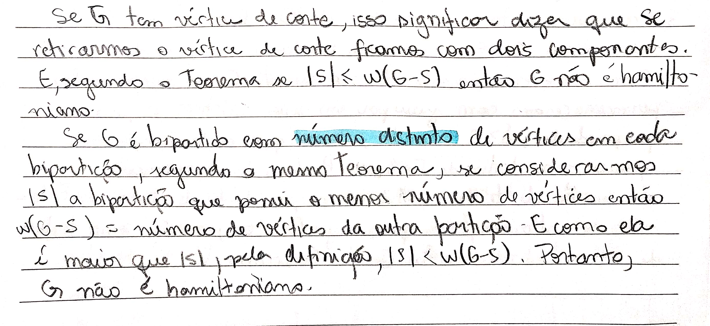

# Exercícios

## 1\).

#### Para cada vértice v do grafo de Petersen, mostre que existe um caminho hamiltoniano com vértice inicial v.

## 2\).

#### Mostre que se G tem vértice de core ou se G é bipartido com número distinto de vértices em cada bipartição então G não é hamiltoniano.

