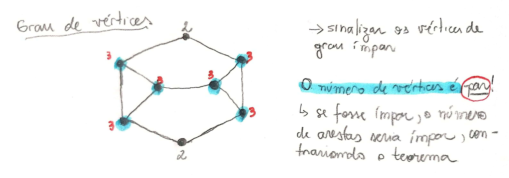

# Grau de Vértices

## Definição

O grau de um vértice $$v$$ em um grafo $$G$$ \(denotado por $$d ( v )$$ \) é o número de arestas de $$G$$ que incidem em $$v$$ . Cada **laço** _****_conta como **duas** arestas. Denotamos por $$δ ( G )$$ e $$∆( G )$$ o grau **mínimo** e **máximo** de vértices de $$G$$ , respectivamente. Quando $$G$$ estiver subentendido escreveremos apenas $$δ$$ e $$∆$$

## Teorema

$$
\sum_{v \in V(G)}d(v) = 2a
$$

Este teorema afirma que o somatório dos graus dos vértices de um grafo $$G$$ corresponde ao dobro do número de arestas. Mas por quê?

Intuitivamente é um teorema óbvio mas podemos analisar melhor. Como o grau de vértice, por definição é o número de incidências de arestas em um vértice, temos que o grau corresponde à própria quantidade de arestas, logo $$d(v) = a$$ . Porém, quando realizamos o somatório, cada aresta incidente é contada mais uma vez por causa dos vértices adjacentes. Assim, o teorema se satisfaz.

### Exemplo

Desenhe um grafo simples com 5 vértices, cada um com grau 3.

> Pera... é realmente possível?

Não! É impossível, pois as propriedades desse grafo simples não satisfaz o teorema mostrado acima.

### Corolário

Em qualquer grafo, o número de vértices de grau ímpar é par.

#### Prova

Sejam $$V_1$$ e $$V_2 $$ os conjuntos dos vértices de grau **ímpar** e **par**, respectivamente, em um grafo $$G$$ . Então:

$$
\sum_{v \in V_1}d(v) + \sum_{v \in V_2}d(v)  = \sum_{v \in V(G)}d(v) =  2a
$$

Ou seja, dividimos o número total do somatório dos graus dos vértices de um grafo $$G$$ em dois conjuntos. Como a soma do conjunto $$V_2 $$ é par, temos que a soma do conjunto $$V_1 $$ também é par pois eles precisam satisfazer o teorema. Porém como número de graus dos vértices de $$V_1$$ é **ímpar**, temos que o $$|V_1| $$ é **par**.

## Grafos k-regulares

Um grafo é _k-_regular se $$d ( v) = k $$ para todo vértice do grafo. Um grafo é regular se for _k-_regular para algum _k_. Por exemplo, os grafos **completos** e os grafos **bipartidos** completos $$K_n,_n$$ são todos **regulares**. Os _k_-cubos também são regulares.

Ou seja, um grafo é regular se todos os graus de seus vértices forem iguais.

> Anotações feita com base nos slides de grafos do professor Marcelo Henriques de Carvalho da FACOM-UFMS.

