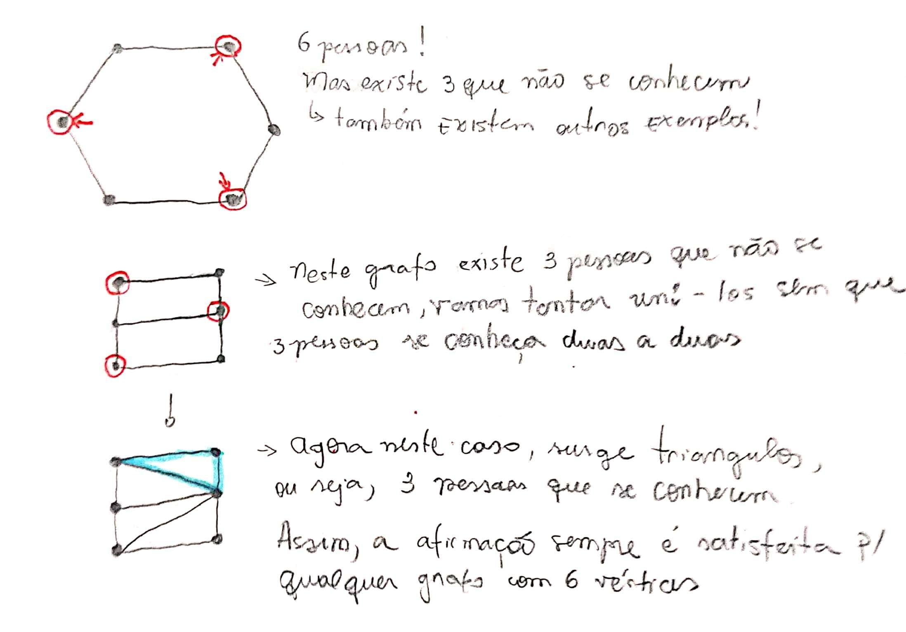

# Exercícios

## 1\).

#### Mostre que em qualquer grupo com seis pessoas, sempre existem três pessoas que se conhecem duas a duas ou três que não se conhecem.

Para demonstrar essa afirmação. Tomamos como analogia, grafos. Em que cada vértice é uma pessoa e a relação de conhecimento é uma aresta.

Neste caso sempre quando tentamos fazer com que não exista 3 pessoas que não se conhecem, a afirmação que 3 pessoas se conhecem duas a duas surge no grafo em forma de um triângulo. Veja abaixo: 

Assim, quando não existir 3 pessoas que não se conhecem \(que não são ligadas por uma aresta\) sempre vai existir um triângulo no grafo. O contrário também é satisfeito. Quando existem 3 pessoas que não se conhecem, sempre vai existir um triangulo no grafo complementar. Esta é a base para a prova.

#### Prova

O problema se reduz a mostrar que existe um triângulo em $$G$$ ou em $$G^c$$ . Seja $$v$$ um vértice de $$G$$ . Então $$ d ( v ) ≥ 3$$ em $$G$$ ou em $$G^c$$\(pois o grau de qualquer vértice em um grafo completo com seis vértices é **cinco**\). Assuma, sem perda de generalidade, que $$v$$ é adjacente aos vértices $$p$$ , $$q$$ e $$r$$ em $$G$$ . Se existe aresta ligando quaisquer dois destes três vértices em $$G$$ , temos um **triângulo** em $$G$$ , caso contrário, temos um triângulo em $$G^c$$.

> Anotações feita com base nos slides de grafos do professor Marcelo Henriques de Carvalho da FACOM-UFMS.

