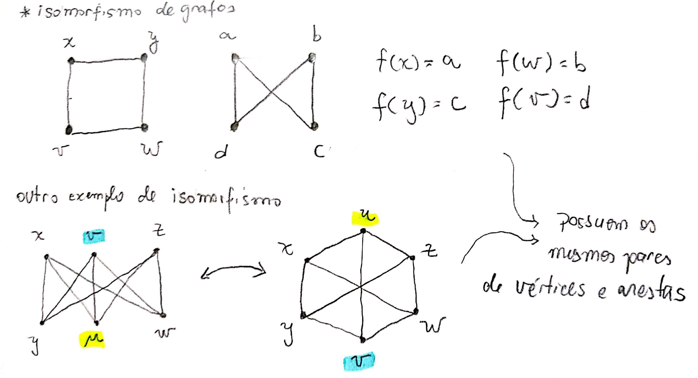

# Isomorfismo

## Definição

De maneira simples, dois grafos são considerados isomorfos quando conseguimos rotulá-los de tal forma que seus vértices e suas arestas sejam iguais. 

Formalmente: 

Dois grafos $$ G = (V,E )$$ e $$G' = ( V', E' )$$ são isomorfos $$ ( G \approxeq G') $$ se existe uma bijeção $$f : V → V'$$ tal que existem $$k$$ arestas ligando $$v$$ a $$w$$ em $$G$$ se, e somente se, existem $$k$$ arestas ligando $$ f ( v ) $$ a $$ f ( w )$$ em $$G'$$ .

> Anotações feita com base nos slides de grafos do professor Marcelo Henriques de Carvalho da FACOM-UFMS.

