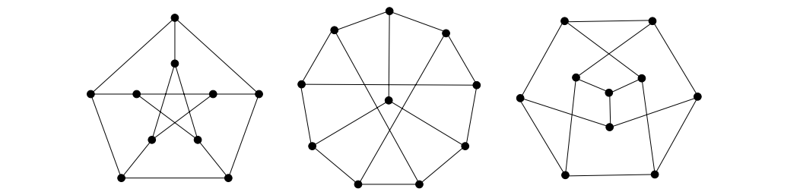
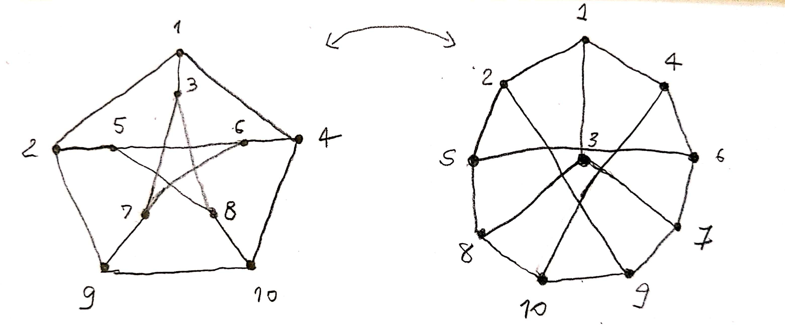
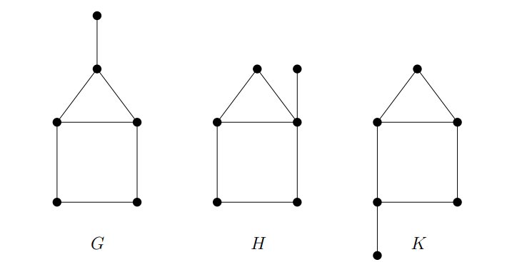
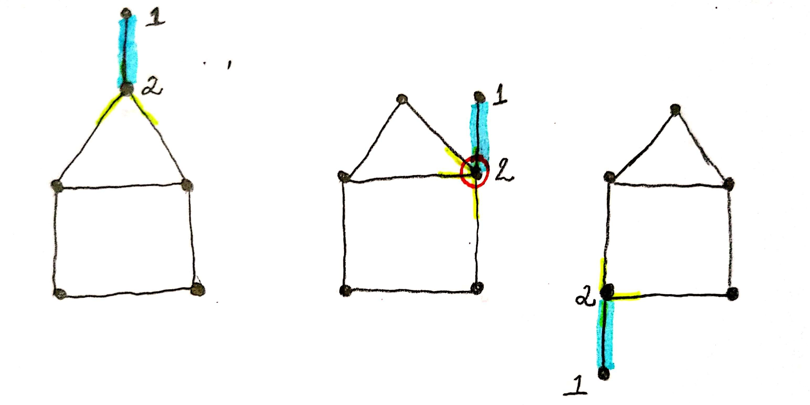

# Exercícios

## 1\).

#### Mostre que os seguintes grafos são isomorfos.

Esses grafos possuem característica especiais e são chamados de grafos de **Petersen**. Para mostrarmos que são isomorfos basta os rotularmos de tal forma que os vértices e arestas se coincidem. Segue abaixo a rotulação dos 2 primeiros.

## 2\).

#### Os grafos abaixo são isomorfos?

Anteriormente provamos que os grafos são isomorfos rotulando-os e percebendo que todas os vértices eram iguais e todas as incidências de arestas também. Neste caso, precisamos provar que **não** são. Um característica importante para provarmos isso é observar as características estruturais de cada grafo. 

Note que no primeiro grafo, o vértice 1 possui apenas uma aresta e o vértice 2 possui 3 arestas. Agora veja no segundo grafo. O vértice 2 possui 4 arestas. Uma incidência a mais do que o primeiro grafo. Estruturalmente os dois não possuem as mesmas características, quebrando a propriedade de isomorfismo. Pensando por esta mesma lógica, conseguimos provar os restantes. 

Veja que o mesmo exemplo de número de arestas se aplica para provarmos que o segundo grafo não é isomorfo com o terceiro.

Já o primeiro e o terceiro grafo, podemos dizer que o vértice 2 forma um triângulo no primeiro grafo, já no terceiro, forma um quadrado. Desta forma as incidências das arestas não são idênticas.

> Anotações feita com base nos slides de grafos do professor Marcelo Henriques de Carvalho da FACOM-UFMS.

