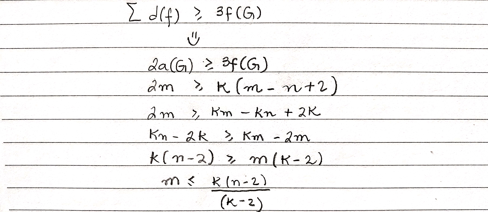

# Exercícios

## 1\).

#### Mostrar que $$K_{3,3}$$ é não planar

## 2\).

#### A cintura de um grafo é o comprimento do menor circuito.

* Seja G um grafo conexo planar com cintura $$k ≥ 3$$ . Mostre que $$m ≤ k(n − 2)/(k − 2)$$ .

* Deduza que o grafo de Petersen é não planar.

## 3\).

#### Mostre que o complemento de um grafo planar simples com pelo menos 11 vértices é não planar.

> Anotações feita com base nos slides de grafos do professor Marcelo Henriques de Carvalho da FACOM-UFMS

