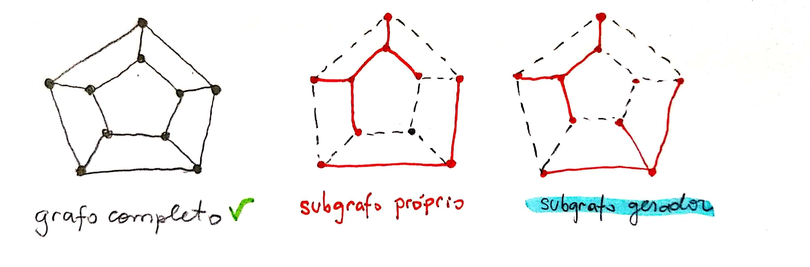

# Subgrafos

## Definição

Um grafo $$H$$ é subgrafo de um grafo $$G$$ \(denotado por $$H ⊆ G$$ \) se $$V (H) ⊆ V (G)$$ e $$E(H) ⊆ E(G)$$ .

Ou seja, um grafo é um subgrafo de outro quando este possui vértices e arestas que estão contidos no grafo-pai.

## Subgrafo próprio

Quando $$H ⊆ G$$ mas $$H \neq G$$ , escrevemos $$H ⊂ G$$ e dizemos que $$H$$ é um subgrafo próprio de $$G$$ .

Ou seja, um subgrafo é próprio quando ele não é o próprio grafo G em sua totalidade.

## Subgrafo gerador

É um subgrafo $$H$$ tal que $$V (H) = V (G)$$ . Ou seja, quando o número total de vértices do grafo $$G$$ também pertence ao subgrafo $$H$$ .

## Exemplo

> Anotações feita com base nos slides de grafos do professor Marcelo Henriques de Carvalho da FACOM-UFMS.

