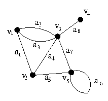

# Tipos de Grafos

## Grafo Simples

Um grafo simples não possui laço nem aresta paralela.

## Ordem de Grafos e Grafo Vazio

Ordem de grafos são o número de vértices que ele possui. E um grafo é vazio quando não possui nenhum vértice.

## Grafo Completo

Um grafo é denominado completo quando todos os seus pares de vértices distintos se ligam por meio de uma aresta. Como uma combinação entre vértices e arestas. Denotamos um grafo completo de $$n $$ vértices como $$K_n $$ .

Um exemplo de grafo completo seria a demonstração de grafo simples acima. Onde todos os pares distintos de vértices se conectam por meio de uma aresta. Ou seja, todas as combinações possíveis entre vértices distintos são cumpridas.

## Grafo bipartido

Um grafo é considerado bipartido quando conseguimos dividí-lo em duas partes \(subconjuntos\) $$X$$ e $$Y$$ em que cada vértice \(seus extremos\) de **X** se conecta com outro vértice de **Y**.  Um par $$(X, Y)$$ é chamado de _**bipartição**_ do grafo.

## Grafo bipartido completo

A completude de um grafo bipartido satisfaz a mesma regra de um Grafo Completo. Mas neste caso um grafo bipartido é completo quando todos os vértices do subconjunto **X** se liga por meio de um aresta com todos os vértices do subconjunto **Y**. Se $$|X| = m$$ e $$|Y| = n$$ , o grafo bipartido completo é denotado por $$K_m,_n$$ .

> Anotações feita com base nos slides de grafos do professor Marcelo Henriques de Carvalho da FACOM-UFMS.

