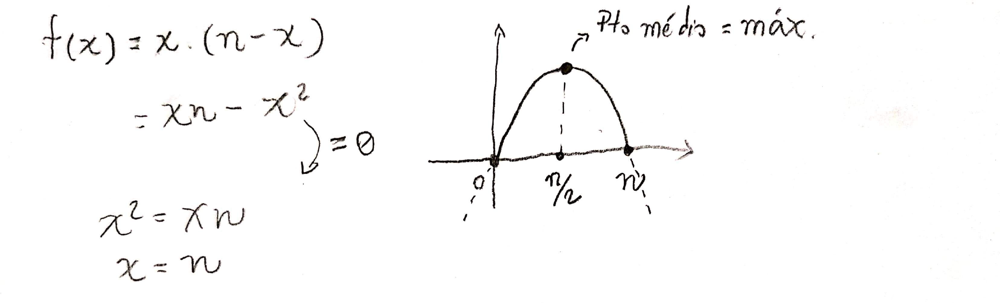
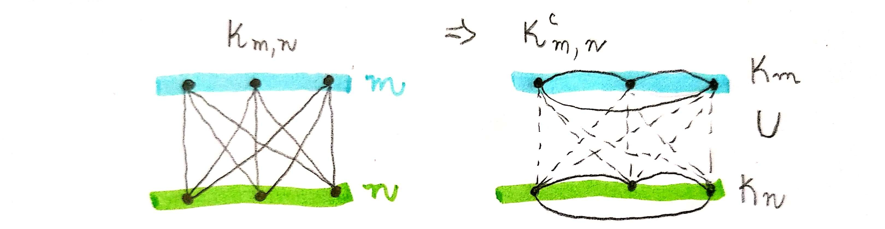
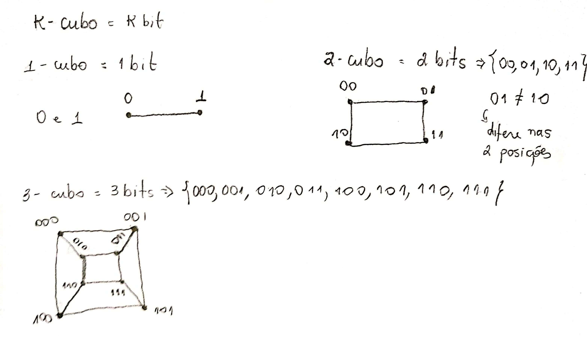

# Exercícios

## 1\).

#### Quantas arestas tem o grafo $$K_m,_n $$ ?

Já que estamos falando de um grafo bipartido completo, o total de arestas seria a combinação de todos os vértices distintos e _**m**_ ****com _**n**_. Sendo assim, o número de arestas é $$m.n $$ .

## 2\).

#### Qual é o número máximo de arestas em um grafo simples e bipartido com _n_ vértices?

Considere $$G$$ um grafo simples e bipartido com $$n$$ vértices. Tome uma parte de $$V(G)$$ , ou seja, o número total de vértices, como $$x$$ vértices. O resto dos vértices neste caso seria $$n - x$$ . Então o total de arestas seria dado pela fórmula $$f(x) = x.(n-x)$$ . Precisamos descobrir o ponto onde o máximo dessa função ocorre.

Assim, o ponto máximo ocorre quando o número de vértices é $$\frac{n}{2}$$ . Logo, o número total de vértices é $$\frac{n}{2} . \frac{n}{2} = \frac{n^2}{4}$$ , por tratar-se de uma divisão e como o número de arestas é um inteiro, colocamos o resultado em inteiro, ficando assim $$\lfloor\frac{n^2}{4}\rfloor$$ .

## 3\).

#### Qual o número máximo de arestas em um grafo simples com $$n$$ vértices?

Neste caso não estamos analisando um grafo bipartido mas sim um grafo apenas simples. Neste caso analisemos do mesmo modo que já fizemos aqui, por meio de combinações. Ora, a quantidade máxima de arestas seria a combinação entre vértices dois a dois. Pois um aresta é a ligação de dois extremos. Neste caso:

$$
K_n,_2 = \frac{n!}{2! (n-2)!} = \frac{n.(n-1).(n-2)!}{2!(n-2)!} = \frac{n.(n-1)}{2}
$$

Cortamos o $$(n-2)!$$ e o resultado do número máximo de arestas em um grafo simples é $$\frac{n.(n-1)}{2}$$ .

## 4\).

#### O complemento $$G^c$$ de um grafo simples $$G$$ é um grafo simples cujo conjunto de vértices é o próprio $$V (G)$$ , e dois vértices são adjacentes em $$G^c$$ se eles não são adjacentes em $$G$$ . Descreva os grafos $$K^c_n$$ e $$K^c_m,_n$$ .

Este exercício nos mostra a propriedade de um complemento de um grafo simples. Temos que descrever os grafos  $$K^c_n$$ e $$K^c_m,_n$$ . O grafo $$K^c_n$$ é um grafo simples completo com n vértices, neste caso o complemento seria um grafo sem nenhuma aresta.

> Note que a propriedade de complemento se refere apenas ao universo das arestas e não inclui os vértices.

O grafo $$K_m,_n$$é um grafo bipartido com m e n subconjuntos de vértices. Neste caso todos os vértices do subconjunto m está ligado com todos os vértices do subconjunto n, logo o $$K^c_m,_n$$seria todas as arestas faltantes para que o grafo $$K_m,_n$$se torne um grafo completo. Veja o exemplo:

Neste caso temos o complemento como sendo as arestas entre os vértices adjacentes de cada subconjunto. Assim o complemento de $$K_m,_n$$é $$K_m$$ , ou seja, um grafo simples completo do subconjunto $$m$$ **união** com $$K_n$$ , um grafo simples completo do subconjunto $$n$$ . 

## 5\).

#### Mostre que se $$G$$ é um grafo simples com $$n$$ vértices então $$G ∪ G^c = K_n$$ .

Esta questão apenas demonstra a propriedade de complemento de grafos. Ou seja, um grafo simples com n vértices unido com seu complemento resulta num grafo completo, por definição.

## 6\).

#### Um cubo de dimensão $$k$$ , também conhecido como _k_-cubo, é o grafo cujo conjunto de vértices é formado por todas as sequências de $$k$$ bits, e dois vértices estão ligados por uma aresta se eles diferem em exatamente uma posição.

* Desenhe o 1-cubo, o 2-cubo e o 3-cubo.

Conseguimos ter uma ideia de como funciona a lógica de um k-cubo.

* Quantos vértices tem o k-cubo?

Como um k-cubo é representado por uma sequencia de k bits, o número de vértices é $$2^k$$ 

* Quantas arestas tem o k-cubo?

Não é tão intuitivo como saber o número de vértices mas sabemos que em cada vértices incide $$k$$ arestas. Ou seja o número de vértices vezes k incidências: $$2^k.k$$ . No entanto, esta multiplicação conta uma aresta de cada vértice duas vezes por causa da adjacência. Assim a fórmula final é $$\frac{2^k.k}{2}$$.

* Mostre que o k-cubo é bipartido.

Como o número de vértices é construído pela sequência de potências de 2, conseguimos dividir o k-cubo em dois subconjuntos de $$\frac{2^k}{2}$$. Para que a bipartição seja satisfeita cada subconjunto precisa conter todas as sequências em que os bits diferem em duas posições. Fazendo a divisão desta forma, não seria possível ter arestas adjacentes dentro de uma mesmo conjunto conforme a propriedade de um k-cubo. Sendo assim, conseguimos dividir um k-cubo de tal maneira que a bipartição ocorra.

